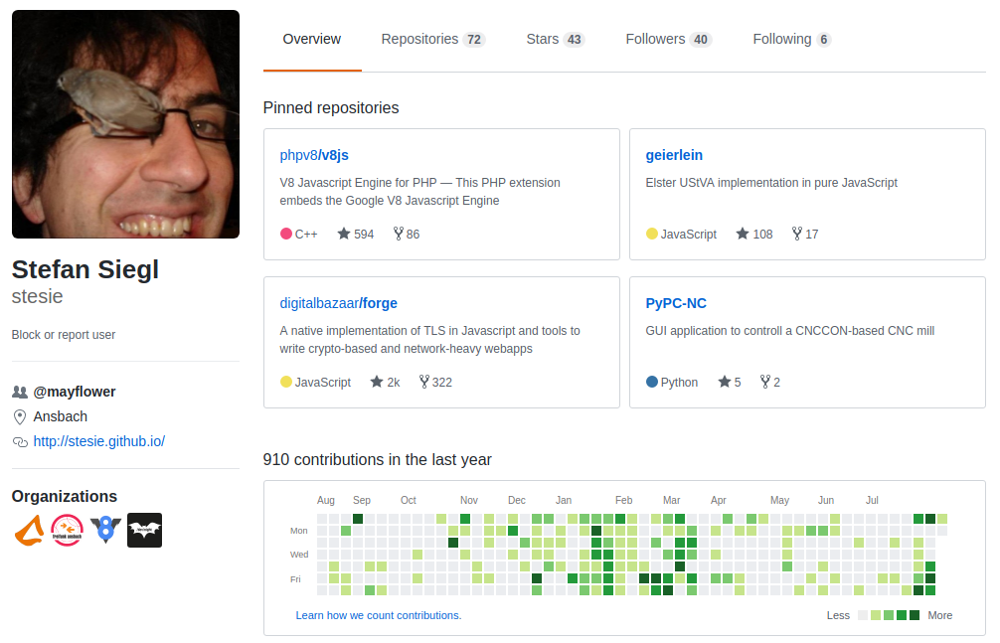

<div class="logos">


</div>

# Putting V8 into PHP for fun and profit

Stefan Siegl / @stesie23

Mayflower GmbH

PHP-Track @ FrOSCon 2017-08-19

Note:

* Hello everyone!
* anyone who doesn't speak German in the room?

<!--s-->
# Who am I?



Note:

* my name is Stefan Siegl, yet at Mayflower I'm primarily called Rolf, so if you call me Rolf that's also fine
* as you can see I'm affiliated with V8Js PHP extension, so maybe this talk is a bit biased, but I'll try to be objective :)
* I'm doing some open source stuff of PHP, you might have heard of Geierlein (at least if you're a freelancer),
  a free open source Elster client for VAT declarations

<!--s-->
# Why put V8 into PHP!?

<!--v-->

... WTH, there's Node.js nowadays ...

<div class="fragment">
  

  <p>
    ... and we all want to do micro services, right?
  </p>
</div>

<!--v-->
## well yes, but ...

* just hosting a PHP monolith?
* in need of close integration?
* want to run user controlled code (in a sandbox)?

Note:

* Node.js might be an option, but if you're currently just hosting a PHP monolith adding Node.js will be quite some
  extra burden to your operations (although using V8 in PHP doesn't come for nothing)
* interacting with a seperate Node.js micro service via REST API can quickly become expensive if you call back
  and forth multiple times

<!--v-->
## okay, so what for then?

<!--v-->
## customizable import/export pipeline

what I did back @Tradebyte:

* PHP SaaS monolith, CSV/XML parsing done in PHP
* normal imports: processing in PHP + Import Backend API
* v8js imports: every raw record passed to V8Js + Backend API exposed

<!--v-->
<div class="logos">
  
</div>

## hooking into event system

Dreamfactory does this:
* (optional: self-host) Backend as a Service
* configurable backend, automatically exposed via REST + Swagger Docs
* every request & response ran through V8Js


<!--v-->
## server-side rendering

Facebook does this (and others):


<!--v-->
* share code w/ frontend, e.g. complex validation logic

(maybe an option, not seen anyone doing yet)

<!--s-->
## ext-v8

* http://pecl.php.net/package/v8
* https://github.com/pinepain/php-v8
* by Bogdan Padalko, since ~July 2016
* low-level integration of Google's V8
* PHP7 only

<!--v-->
```php
$isolate = new \V8\Isolate();
$context = new \V8\Context($isolate);
$source = new \V8\StringValue($isolate, "'Hello' + ', World!'");

$script = new \V8\Script($context, $source);
$result = $script->Run($context);

echo $result->ToString($context)->Value(), PHP_EOL;
```

<!--s-->
## ext-v8js

* http://pecl.php.net/package/v8js
* https://github.com/phpv8/v8js
* first release in 2010 by Jani Taskinen
* ... who turned police officer meanwhile
* opinionated, highlevel integration

<!--v-->
## ext-v8js ...

* myself contributing since mid of 2013
* maintainer since May 2015
* ported to PHP7 (seperate branch)
* works on PHP7.2 and Windows

<!--v-->

```php
$v8js = new V8Js();
$v8js->executeString("print('Hello World\\n');");
```


<!--s-->
# wanna try them?

* php-v8 and php-v8js are both in Nix(OS)
- php-v8js in homebrew
- Heroku Custom Repo
- Windows DLLs for PHP7 :)


<!--s-->
# V8Js Demo

<!--v-->
## Script Exceptions

```php
try {
  $v8js->executeString("{]]");
} catch(V8JsScriptException $e) {
  echo $e->getMessage();
}

// --> V8Js::compileString():1: SyntaxError: Unexpected token ]
```

<!--v-->
## Functions in

```php
$v8js->sayHello = function() {
  echo "Hello World\n";
};

$v8js->executeString(' PHP.sayHello(); ');
// --> Hello World
```

<!--v-->
## Functions w/ arguments

```php
$v8js->sayHello = function(string $name = "World") {
  printf("Hello %s\n", $name);
};

$v8js->executeString(' PHP.sayHello(); ');
// --> Hello World

$v8js->executeString(' PHP.sayHello("Rolf"); ');
// --> Hello Rolf
```

<!--v-->
## Functions out

```php
$sayHello = $v8js->executeString(
  ' (function(name) { print("Hello " + name + "\\n"); }) '
);

print_r($sayHello);
/* -->
 * V8Function Object
 * (
 * )
 */

$sayHello("Rolf");
// --> Hello Rolf
```

<!--v-->
## Objects in

```php
class Greeter
{
  private $name;

  public function setName(string $name)
  {
    $this->name = $name;
  }

  public function sayHello()
  {
    printf("Hello %s\n", $this->name);
  }
}

$v8js->greeter = new Greeter();
$v8js->executeString( <<<EOJS
  PHP.greeter.setName('Rolf');
  PHP.greeter.sayHello();
EOJS
);
// --> Hello Rolf
```

<!--v-->
## Constructor Fun \o/

```php
$v8js->executeString( ' var_dump(PHP.greeter.constructor); ');

/* -->
 * object(Closure)#694038217 {
 *     function Greeter() { [native code] }
 * }
 */

$v8js->executeString( ' anotherGreeter = new PHP.greeter.constructor(); ');
$v8js->executeString( ' anotherGreeter.setName("Hanna"); ');
$v8js->executeString( ' anotherGreeter.sayHello(); ');
// --> Hello Hanna
```


<!--v-->
## Objects out

```php
$obj = $v8js->executeString('({ foo: 23, bar: 42 })');
print_r($obj);

/* -->
 * V8Object Object
 * (
 *     [foo] => 23
 *     [bar] => 42
 * )
 */
```

<!--v-->
## Generators

ES6 and PHP 5.5 both introduced generators  
... so let's have fun \o/

```php
$jsGenerator = $v8->executeString( <<<EOJS
  (function*() {
    yield 1;
    yield 2;
    yield 3;
  })
EOJS
);

foreach($jsGenerator() as $i) {
  var_dump($i);
}
```

<!--v-->
## Sandboxing

```php
$v8js->setTimeLimit(500);
$v8js->setMemoryLimit(20E6);
```

Caveat: slowly eating up `memory_limit`

<!--s-->
## Heap Snapshots


<!--v-->
## Creating a Snapshot

```php
$src = file_get_contents('build/react-bundle.js');
$src .= file_get_contents('react-app.js');
$snapshot = V8Js::createSnapshot($src);

// cache $snapshot in $storage
```

<!--v-->
## Re-using a Snapshot

```php
// fetch $snapshot from $storage
$v8 = new V8Js('myapp', [], [], true, $snapshot)
```


<!--s-->
# Resources


<!--v-->
# Questions?

<!--v-->

Mail: stefan.siegl@mayflower.de

Twitter: @stesie23

Slides: https://stesie.github.io/v8js-talk-en/
